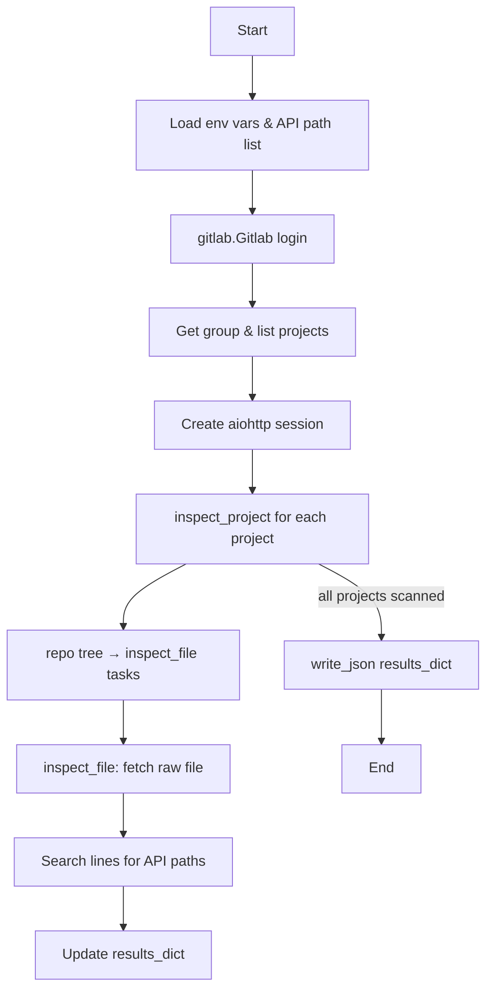
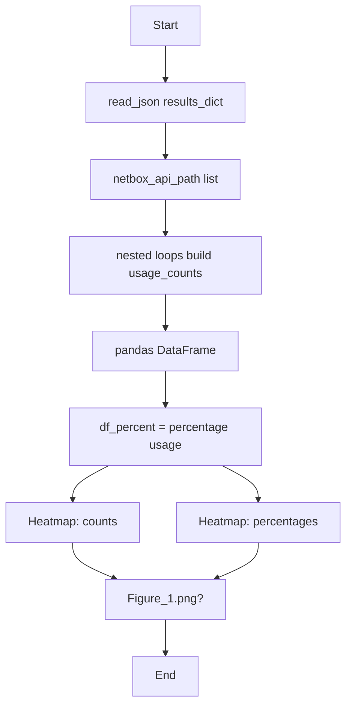
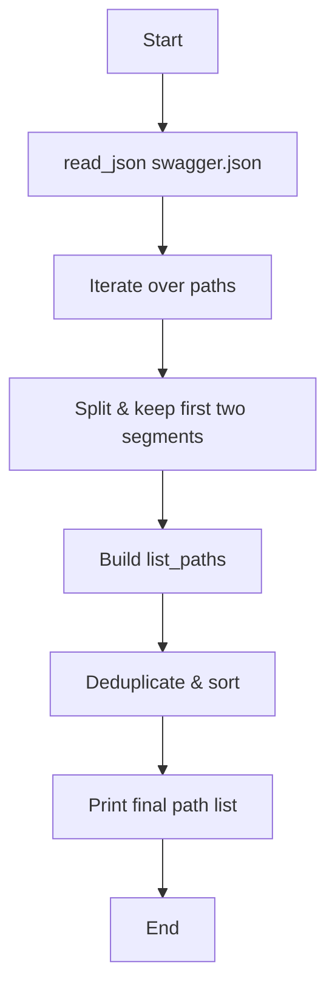
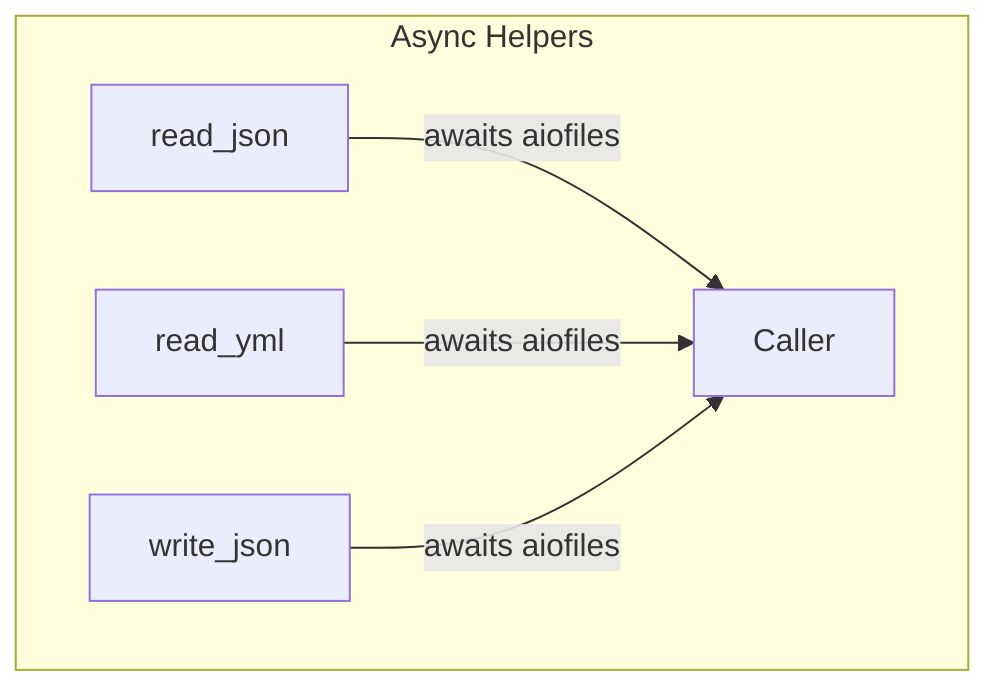

# NetBox Auditor

Toolkit for scanning GitLab repositories to discover NetBox API usage and visualizing the findings.

---

## Repository Layout
| Path | Purpose |
|------|---------|
| `audit_netbox_use.py` | Asynchronously crawls GitLab projects, searches `.py` files for NetBox API references, writes a nested JSON report. |
| `audit_stats.py` | Reads the JSON report, aggregates usage counts, and renders heatmaps. |
| `get_netbox_api_paths.py` | Extracts API path prefixes from `swagger.json` to build the static `netbox_api_path` list. |
| `libs/file_library.py` | Synchronous helpers for reading/writing JSON/YAML. |
| `libs/file_library_async.py` | Asynchronous versions of the helpers using `aiofiles`. |
| `netbox_api_paths_usage.json` | Example output from `audit_netbox_use.py`. |
| `swagger.json` | NetBox OpenAPI specification consumed by `get_netbox_api_paths.py`. |
| `Figure_1.png` | Sample heatmap produced by `audit_stats.py`. |

---

## Requirements
- Python 3.9+
- `python-gitlab`
- `aiohttp`
- `pandas`
- `matplotlib`
- `aiofiles`
- `PyYAML`

Install dependencies:
```bash
pip install python-gitlab aiohttp pandas matplotlib aiofiles PyYAML
```

---

## Configuration
Set the following environment variables before running the scanner:
```bash
export PRIVATE_TOKEN="<your_gitlab_token>"
export GITLAB_URL="https://gitlab.example.com"
export GROUP_ID="12345"         # GitLab group to scan
```

These values are referenced in `audit_netbox_use.py` when authenticating with GitLab and traversing projects.

---

## Running the Scanner

```bash
python audit_netbox_use.py
```

- Discovers all projects in the configured group (including subgroups).
- Fetches every `.py` file asynchronously.
- Records any line containing a known NetBox API path.
- Saves results to `netbox_api_paths_usage.json`.

### Flow (audit_netbox_use.py)



---

## Analyzing Results

```bash
python audit_stats.py
```

- Loads `netbox_api_paths_usage.json`.
- Counts occurrences of each API path per project.
- Creates heatmaps for absolute counts and percentage distribution.

### Flow (audit_stats.py)



---

## Updating the API Path List
If NetBox upgrades introduce new endpoints, regenerate `netbox_api_path`:

```bash
python get_netbox_api_paths.py > api_paths.txt
```

Replace the static list in the scripts with the new output.

### Flow (get_netbox_api_paths.py)



---

## Utility Modules

### `libs/file_library.py`

```mermaid
flowchart TD
    subgraph Synchronous Helpers
        RJ[read_json] -->|tuple(status, data)| Caller
        RY[read_yml] -->|tuple(status, data)| Caller
        WJ[write_json] -->|tuple(status, message)| Caller
    end
```

### `libs/file_library_async.py`



---

## Data Format
`netbox_api_paths_usage.json` structure:

```json
{
  "group_name": {
    "project_name": {
      "path/to/file.py": {
        "42": "line containing .dcim.devices."
      }
    }
  }
}
```

---

## Next Steps
- Add CLI arguments for custom file extensions or output locations.
- Introduce unit tests for the utilities.
- Expand analytics (e.g., time-series trends, per-group summaries).

---

Happy auditing!
